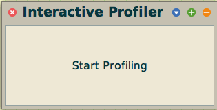

# InteractiveProfilingTool [](https://travis-ci.org/hpi-swa-teaching/InteractiveProfilingTool) 

This is a graphical Profiling-Tool for use in the Squeak-Smalltalk Environment.


## Features

- Profile the whole world via a start/stop-button
- See the calls made during the profiling as a graphical tree structure
- Filter the tree by method and class name
- Visual highlighting of expensive method calls
- Browse called methods directly from the profiler
- Edit code directly inside the profiler
- View GC stats for the profiled period

## Setup

Setup the project using Metacello. You may specify a branch other than `master`.

```smalltalk
Metacello new
    baseline: 'InteractiveProfilingTool';
    repository: 'github://hpi-swa-teaching/InteractiveProfilingTool:master/packages';
    load.
```
## Usage

### Profiling World
1. Open the Profiler via the World Menu under Apps -> Interactive Profiler
2. Toggle profiling



3. A report window as shown above opens  
4. Profit :money_with_wings:

## Remarks

1. A relevance threshold is employed to hide method calls with an insignificant runtime.  The value is hardcoded in such a way that method calls with less than 1% relative runtime are excluded from the result tree. If you want to change the threshhold, you can do so in `IPTMessageTallyWrapper >> callRelevancePercentage`.

2. Moreover, the spy-on functionality that allows profiling of individual methods is not yet implemented. If you know what you are doing, you can make a hacky solution like:
```smalltalk
tally := MessageTally new.
tally spyEvery: (MessageTally defaultPollPeriod) on: ["put your code here"].
IPTReport openReportFor: tally
```
